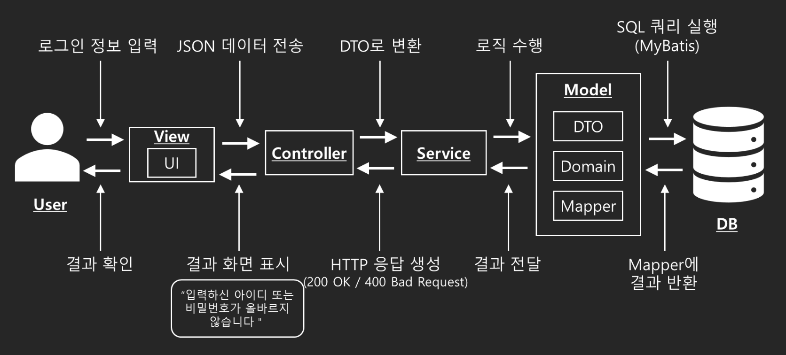

# Planmate

## Proejct Scope
Project Scope: 서울시립대학교 컴퓨터과학부 2024년 소프트웨어공학 프로젝트로, Software Development Life-Cycle 을 기반으로 객체지향 소프트웨어공학 방법론을 적용하여 **수강신청 도우미** 개발   

## Project Duration

2024년 2학기

## Highlighted Features
1. **회원가입**
2. **로그인/로그아웃**
3. **강의 조회**
   - 검색어 입력
   - 학부/과, 교과구분, 학년, 요일, 시간 선택
   - 공학인증 과목만 보기
   - 재수강 가능 과목만 보기
   - 수강 금지 과목 제외
   - 시간이 겹치는 과목 제외
   - 과목 시간표에 담기
4. **선수/후수 과목 조회**
   - 학부/과 선택
   - 선수/후수 데이터 표출
5. **나의 성적표 조회**
   - 나의 성적 등록
   - 전체 평점, 취득 학점, 전공 평점, 전공 학점, 교양 학점 표출

 

## Demo Video

 

## Project Constraints
본 서비스의 제약사항은 다음과 같다.

보안 및 학사규정 등의 이유로 수강신청 기능 그 자체를 구현하지는 않았다. 본 서비스는 사용자가 수강신청을 계획하고 준비하는 과정에서의 어려움을 해결하는데 그 중점을 둔다. 이에 사용되는 학사 DB는 서울시립대학교 대학행정정보시스템이 제공하는 강좌 정보를 바탕으로 구성하였다.   
서울시립대학교 대학행정정보시스템이 자체적으로 제공하고 있는 기능은 구현하지 않았다. 그 예시로는 졸업요건을 충족하기 위해 수강해야 하는 영역별 학점 수를 조회하는 기능 등이 있다. 본 서비스는 대학행정정보시스템에 구현되어 있지 않으나, 사용자의 수강신청에의 편의를 위해 필요한 기능에 초점을 맞춘다. 또한 구현의 난도와 주어진 개발 기간을 고려하여, 학생의 시간표를 가시적으로 표출하는 기능을 구현하지 않았다.

 

## High-Level Architecture
본 서비스의 아키텍처는 MVC 아키텍처에 Service Layer를 추가하여 구축하였다.   

 

## Technology stacks

- Front-end: react(18.3.1), mui(6.1.9)
- Back-end: Java Spring
- DB: Oracle

 

## Project Deliverables

- 요구사항 분석 명세서: [링크](/artifacts/srs-수강신청도우미-v02-최종.docx)
- Software Architecture: [링크](/artifacts/srs-수강신청도우미-UML_Diagrams_Documents.docx)
- UI Design: [링크](/artifacts/srs-수강신청도우미-UI_Design_Document.docx)
- UI Design Diagram(Figma): [링크](/artifacts/수강신청%20도우미%20UI%20Design%20Diagram.fig)
- Coding Standard: [링크](/artifacts/srs-수강신청도우미-Coding%20standard.docx)

 

### Branch Description

- `main`: 최종 코드와 산출물이 모두 포함된 브랜치
- `develop`: 개발 중 통합과 테스트 및 버그 수정을 위한 브랜치
- `feature-register`: 회원가입, 로그인 기능 개발을 위한 브랜치
- `feature-frontend`: 프론트엔드 개발을 위한 브랜치
- `back-end`: 백엔드와 db 연결 및 강의 조회, 시간표 등의 기능 개발을 위한 브랜치
- `real_final`: 최종 시연을 위한 테스트 및 버그 수정을 위한 브랜치

 

### Code Documentation

#### Front-end

프론트엔드의 코드는 /app/planmate/src/ 폴더에 위치해 있다. react를 사용해 Single Page Application으로 구현했고, 페이지 이동을 위해 react-router-dom을 사용했다. 디자인은 mui를 기반으로 커스터마이즈 해서 사용했다. 주요 페이지들은 /pages 폴더에 구현되어 있고, 페이지가 공통으로 사용하는 요소는 /components 폴더에 구현했다.

- `App.js`: 웹 애플리케이션의 메인 진입점 역할을 하며, react-router-dom을 사용해 페이지 이동을 관리한다.
- `/pages/Login.js`: 로그인 페이지를 구현한 코드이다. 입력 필드와 각 입력에 대한 검증 로직이 구현되어 있고, 올바른 입력이 들어오면 서버에 로그인을 요청한다.
- `/pages/Register.js`: 회원가입 페이지를 구현한 코드이다. 페이지 로드 시 서버로부터 학과 리스트를 받아와 유저에게 보여준다. 입력 필드와 각 입력에 대한 검증 로직이 구현되어 있고, 올바른 입력이 들어오면 서버에 회원가입을 요청한다.
- `/pages/Transcript.js`: 성적표 페이지를 구현한 코드이다. 유저는 로그인 된 상태일때 해당 페이지에 접근할 수 있다. 페이지 로드 시 서버로부터 유저의 성적표 정보를 받아와 유저에게 보여준다. 유저는 자신의 성적표를 테이블 형태로 확인할 수 있고, 직접 수정해 서버에 저장할 수 있다.
- `/pages/Prerequisite.js`: 선수/후수 과목 조회 페이지를 구현한 코드이다. 페이지 로드 시 서버로부터 학과 리스트를 받아와 유저에게 보여준다. 유저가 학과를 선택 시 서버에 해당 학과의 선수/후수 과목 리스트를 요청해 테이블 형태로 보여준다.
- `/pages/Index.js`: 강의 조회 페이지를 구현한 코드이다. 유저가 조회 버튼을 누르면 필터에 설정된 값으로 서버에게 강의 리스트를 요청해 테이블 형태로 보여준다. 유저가 특정 강의에 대해 시간표에 담기 버튼을 누르면 서버에 요청을 보내 유저의 시간표에 추가한다.
- `/components/Header.js`: 강의 조회, 선수/후수 과목 조회, 성적표 페이지에서 사용되는 헤더를 구현한 코드이다. 각 메뉴를 누르면 페이지를 이동할 수 있고, 현재 페이지는 메뉴에 파란색으로 강조 표시되도록 구현했다. 각 페이지에서는 `<Header />`를 추가하는 것으로 사용할 수 있다.

#### Back-end

백엔드의 코드는 /src 폴더에 위치해 있다. Spring Boot와 MyBatis를 사용하여 RESTful API를 구현하였다. 
각 기능은 관련된 Mapper와 Service Layer를 통해 데이터베이스와의 상호작용을 처리하며, 클라이언트의 요청에 따라 필요한 데이터를 효율적으로 조회하고 반환한다. MVC 아키텍처에 Service Layer를 추가하여 유지보수와 확장에 용이하다.

#####  Library 및 Framework
- __String Boot__: 웹 애플리케이션의 기본 프레임워크로 사용된다. RESTful API를 신속하게 개발할 수 있도록 돕는다. 
- __MyBatis__: SQL쿼리를 매핑하여 데이터베이스와의 상호작용을 간편하게 처리한다.
- __Thymeleaf__: 서버 사이드 템플릿 엔진으로, HTML 파일을 동적으로 생성하는 데 사용된다.
- __Lombok__: Getter, Setter 등을 자동으로 생성하여 코드의 가독성을 높인다다. 
- __Servlet__: HTTP 요청을 처리하고, 세션 관리를 위해 사용된다.
- __JUnit__: 단위 테스트를 위해 사용된다.

##### 주요 클래스 및 메소드
- __Controller__
    - `SignUpController.java`: 회원가입 처리를 위한 API를 제공한다.
        - signUp(): 학생으로부터 회원가입 정보를 받아, SignUpService를 호출하여 새로운 학생을 데이터베이스에 등록한다. 입력 검증 후, 성공 여부에 따라 적절한 응답을 반환한다.
    - `LoginController.java`: 세션을 이용하여 로그인 기능을 제공한다.
        - logIn(): 학생으로부터 로그인 정보를 받아, LoginService를 호출하여 세션을 생성하고 인증 과정을 수행한다. 로그인 성공 시 학생 정보를 세션에 저장하고, 실패 시 오류 메시지를 반환한다.
    - `LogoutController.java`: 로그아웃 기능을 제공한다. 
        - logOut(): 활성화된 세션을 무효화하여 로그아웃 처리한다.
    - `SessionController.java`: 세션 상태 확인을 위한 API를 제공한다.
        - checkSession(): 학생의 세션 상태를 확인하고, 세션이 유효하면 정보를 반환한다.
    - `StudentController.java`: 학생 정보와 관련된 API를 제공한다.
        - getAllStudents(): StudentService를 호출하여 데이터베이스에서 모든 학생 정보를 조회하고, 이를 학생에게 반환한다.
        - deleteStudent(): ID를 통해 특정 학생의 정보를 삭제한다. 삭제 성공 여부에 따라 응답을 반환한다.
    - `DepartmnetController.java`: 학과와 관련된 API를 제공한다.
        - getAllDepartment(): DepartmentService를 호출하여 데이터베이스에 있는 모든 학과 정보를 조회하고, 이를 학생에게 반환합니다.
    - `MainPageController.java`: 강의 검색 및 시간표와 관련된 API를 제공한다.
        - searchCourseList(): 학생으로부터 검색 조건을 받아 CourseSearchService를 호출하여 강의 목록을 검색한다.
        - updateTimetable(): 학생의 시간표를 업데이트하는 로직을 처리한다.
        - addCourseToTimetable(): 시간표에 특정 과목을 추가하는 로직을 처리한다..
    - `PrePostCourseeController`: 선수/후수 과목 정보를 조회하는 API를 제공한다.
        - getPrePostCourseList(): 특정 학과를 기반으로 선수/후수 과목 목록을 조회하여 학생에게 반환한다. PrePostCourseService를 호출하여 데이터를 처리한다.
    - `StudentReportController`: 학생 성적표 조회와 관련된 API를 제공한다.
        - studentReport(): studentCode를 통해 학생의 성적 정보를 반환한다.

- __Service__
    - `SignUpService.java`: 회원가입 비즈니스 로직을 처리한다. 
        - signUp(StudentSignUpDto studentSignUpDto): checkDuplicateId()를 통해 아이디 중복 여부를 확인하고, generateStudentCode()로 학번을 생성한 후 데이터베이스에 정보를 저장한다. 
        - generateStudentCode(): 임의로 학번을 지정한다. 학번은 900001부터 1씩 증가한다. 
    - `LoginService.java`: 로그인 비즈니스 로직을 처리한다.
        - logIn(String id, String pw): 입력된 아이디와 비밀번호를 검증하고, 성공 시 세션을 생성하여 학생 정보를 반환한다.
        - isLoggedIn(String id, String pw): 입력된 아이디와 비밀번호로 로그인 성공 여부를 확인한다.
    - `StudentService.java`: 학생 정보 조회/삭제 비즈니스 로직을 처리한다.
        - getAllStudents(): 데이터베이스에서 모든 학생 정보를 조회하여 반환한다. 
        - deleteStudent(String id): id를 통해 특정 학생 정보를 데이터베이스에서 삭제한다.
    - `DepartmentService.java`: 학과 정보 조회 비즈니스 로직을 처리한다.
        - getAllDepartments(): 데이터베이스에 있는 모든 학과 정보를 조회하여 반환한다. 
    - `CourseSearchServcie.java`: 강의 검색 및 필터링 비즈니스 로직을 처리한다.
        - searchCourseList(CourseSearchCriteria criteria): 학생의 검색 기준을 받아 강의 목록을 검색하고 반환한다. 
        - isOverlapping(StudentScheduleDto course1, CourseDto course2): 두 과목의 시간표를 비교하여 겹침 여부를 판단한다. 
    - `PrePostCourseService.java`: 선수/후수 과목 조회 비즈니스 로직을 처리한다.
        - getPrePostCourseList(String departmentName): 주어진 학과 이름을 기반으로 해당 학과의 선수/후수 과목을 조회하여 반환한다.
    - `TimetableService.java`: 시간표를 관리하는는 비즈니스 로직을 처리합니다. 
        - updateTimetable(String studentCode): 학번을 통해 특정 학생의 시간표를 조회하여 반환한다..
        - addCourseToTimetable(TimetableEntry entry): 과목을 학생의 시간표에 추가합니다.
        - isOverlapping(StudentScheduleDto course1, CourseDto course2): 추가하려는 과목과 기존 시간표의 과목이 겹치는지 확인한다. 

- __Domain__: Domain 파일은 데이터베이스 테이블과 매핑되는 주요 비즈니스 엔티티를 정의하며, 각 클래스는 속성과 관련된 비즈니스 로직을 포함한다.

- __DTO(Data Transfer Object)__: DTO 파일은 클라이언트와 서버 간의 데이터 전송을 위한 객체로, 필요한 데이터만 포함하여 API 요청 및 응답 시 사용된다.

- __Mapper__
    - Mapper xml: MyBatis 프레임워크를 사용하여 SQL 쿼리를 실행하고, DTO와 매핑하여 결과를 반환합니다. 각 Mapper Interface 파일에 대응하는 XML파일이 존재한다.
    - Mapper Interface: 데이터베이스와의 상호작용을 위한 메소드를 정의하며, XML에 정의된 SQL 쿼리를 호출하여 필요한 데이터를 조회/수정한다.

 

### Test Case and Result

 

## Repository Structure
／root-directory  
├── app／planmate　　　　　　＃ 프론트엔드 소스코드  
│　　├── public　　　　　　　＃ 로고 및 아이콘 파일 저장  
│　　└── src　　　　　　　　＃ 프론트엔드 JavaScript 소스코드  
│　　　　├── components　　　＃ 공통 UI 컴포넌트（헤더）관련 JavaScript 소스코드  
│　　　　└── pages　　　　　＃ 각 페이지 별 JavaScript 소스코드（로그인，강의 조회 등）  
├── artifacts　　　　　　　＃ 프로젝트 문서（요구사항 분석 명세서 등）  
├── classroom　　　　　　　　　＃ Requirements 프레젠테이션 파일   
├── gradle／wrapper　　　　＃ Gradle 빌드 도구 설정 파일   
├── proposal　　　　　　　　　＃ SOW    
├── reports　　　　　　　　　＃ 최종 프레젠테이션 파일      
├── server　　　　　　　　＃ API 명세서 파일 저장  
├── src　　　　　　　　　　＃ 백엔드 소스코드  
│　　└── main　　　　　　　＃ 메인 소스 디렉토리  
│　　　　├── java／com／example／SeProject　＃ Java 패키지 디렉토리  
│　　　　│　　├── controller　＃ 컨트롤러 클래스  
│　　　　│　　├── domain　　　＃ 데이터베이스 엔터티 및 도메인 클래스  
│　　　　│　　├── dto　　　　＃ 데이터 전송 객체（DTO）클래스  
│　　　　│　　├── mapper　　　＃ 데이터 매핑 인터페이스  
│　　　　│　　└── service　　　＃ 비즈니스 로직 처리 클래스  
│　　　　└── resources　　　　＃ 리소스 파일  
│　　　　　　├── mapper　　　　＃ MyBatis 매퍼 XML 파일  
│　　　　　　└── templates　　＃ Thymeleaf HTML 템플릿 파일  
└── README．md　　　　　　　＃ 프로젝트 소개  

 

## Project Team Members (w/roles)

2019920026 서웅진 (DB 구현 및 관리)

2019920011 김민서 (백엔드)

2020920018 류재욱 (프론트엔드)

2021910033 정명훈 (프론트엔드)

2021920017 김영신 (백엔드)
